

  <h3><code>ozen@github ~ $ ./contributions.sh</code></h3>
  
    
  <h3><code>ozen@github ~ $ whoami</code></h3>
  <table>
    <tr>
      <td valign="top"></td>
      <td valign="top"></td>
    </tr>
  </table>

### 👨‍💻 About me

I’m Mohd Zaid, a full stack web developer focused on product-driven work, secure architecture, and modern UI experiences. I build with React, Firebase, Node.js, and scalable frontend/backend patterns for web and mobile products.

- 🔭 Building OzenX, a portfolio and CMS platform
- 🌱 Learning advanced DSA and performance engineering
- 🤝 Open to collaborations on web products and open-source work
- 📫 admin@ozenx.in
- 🌍 Meerut, India

### 🧩 Core stack

### 🔗 Connect

---

⭐️ Built for a clean terminal-style profile README inspired by the animated GitHub profile concept in the reference PDF.
